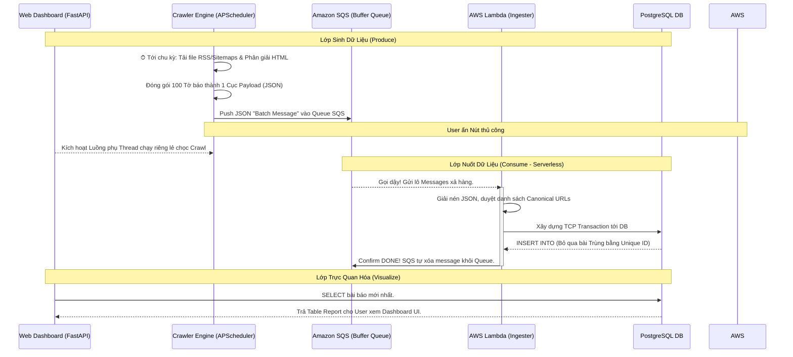

# Hệ Thống Crawler Demo - Tài Liệu Kiến Trúc & Vận Hành (Production)

Tài liệu này mô tả chi tiết từ đầu đến cuối về hình thái kiến trúc, nguyên lý hoạt động, cách dàn xếp các thành phần (Services), phương thức triển khai (CI/CD Pipeline), cũng như các cơ chế Scalable (mở rộng), Storage (lưu trữ), Security (phòng chống hack) cho dự án **Crawler Hệ Thống Phân Tán**.

---

## 1. Tổng Quan Về Hệ Thống (System Overview)

**Hệ thống Crawler** là một giải pháp thu thập tin tức tự động theo thời gian thực (Real-time data ingestion pipeline). 
Thay vì thiết kế nguyên khối (Monolith) chật chội, hệ thống được thiết kế theo tư duy kiến trúc **Decoupled Event-Driven Microservices** (Vi dịch vụ truyền tin qua sự kiện độc lập) và hướng trọn vẹn lên Đám Mây (Cloud-native).

**Sứ mệnh của bài toán:** 
Đảm bảo hệ thống có thể kéo được hàng chục ngàn dòng tin bài báo mới mỗi giờ từ các nguồn cấp RSS và Sitemap XML, chuẩn hóa nội dung (Normalize), loại bỏ trùng lặp và lưu trữ vĩnh viễn trên Cơ sở dữ liệu và Data Lake phục vụ cho các báo cáo phân tích xuất ra (Dashboard UI, S3 Exports) mà **tuyệt đối không làm sụp đổ trung tâm dữ liệu khi lưu lượng tăng đột biến**.

---

## 2. Các Service Cấu Thành & Lý Do Lựa Chọn (Tech Stack Rationale)

Hệ thống được chia nhỏ thành 5 module service chuyên biệt. Mỗi module làm một việc duy nhất, làm một cách hoàn hảo nhất:

### 2.1. API Web Dashboard (`FastAPI/Uvicorn`)
- **Nó làm gì?** Cung cấp một giao diện UI quản trị (Dashboard) và các RESTful API phục vụ tìm kiếm bài báo, trigger crawl thủ công, và export data ra CSV/JSON.
- **Lý do chọn?**
  - Khác với Flask hay Django nặng nề truy xuất đồng bộ, `FastAPI` (chạy trên chuẩn ASGI) sử dụng cơ chế xử lý bất đồng bộ I/O Event-Loop siêu tốc. Rất lý tưởng cho một ứng dụng có các luồng IO streaming hoặc download file nặng lên S3.
  - Ứng dụng chạy kiểu **Stateless (Phi trạng thái)**. Bạn có thể bật 1 hay 100 máy ảo EC2 để gánh Web traffic thì ứng dụng vẫn hoạt động luân chuyển đều chéo máy, không bao giờ lo lắng về việc Session dữ liệu bị khựng lại.

### 2.2. Service Thu Thập Worker Engine (`APScheduler / HTTPX`)
- **Nó làm gì?** Một con bot ma-đơ-canh (background engine) sống ngầm trong Docker. Nhiệm vụ duy nhất là căn giờ (Ví dụ: Cứ 30 phút/Lần) dùng HTTP Requests đi tải RSS/XML của Báo Chí về, băm tách URL/Title và đóng gói lại thành các khối lô (Batches) gửi đi chỗ khác.
- **Lý do chọn?**
  - Vì sao dùng `APScheduler` thay vì `Celery / Redis / RabbitMQ`? Celery là vua của Distributed Task, nhưng nó đòi hỏi kèm theo một cụm Redis/RabbitMQ riêng phải nuôi kẽo kẹt tốn tiền hạ tầng. APScheduler chạy ngầm trực tiếp trên RAM Python process với cú pháp cực nhẹ nhưng vẫn đủ độ tin cậy để lập lịch Cronjob cực vững. Tối đa hóa tỷ lệ "Hiệu Năng/Chi Phí".

### 2.3. Trạm Chuyển Tiếp Tin Nhắn SQS (`Amazon SQS Buffer`)
- **Nó làm gì?** Đứng giữa Worker thu thập và Database lưu trữ. Nó như một cái phễu (Buffer Queue) nhận và lưu tạm Message.
- **Lý do chọn?**
  - Cơ sở dữ liệu quan hệ (PostgreSQL) rất sợ hiện tượng **"Burst Writes"** (Nhồi Bất Tử). Nếu 1 lúc hệ thống có trăm Node thu thập cào về triệu dòng dữ liệu ném thẳng SQL thì Database sẽ khóa bảng (DeadLock), sập Memory ngay lập tức.
  - SQS nhận nạp tin vô hạn từ Worker. Giữ Data an toàn trên Queue. Kéo giãn luồng đổ vào DB thành dòng suối êm đềm thay vì cả trận lũ quét.

### 2.4. Data Ingester Service (`AWS Lambda` + `pg8000`)
- **Nó làm gì?** Một Service vô hình (Serverless Engine). Nó nhận Tín hiệu (Trigger) mỗi khi SQS có message đến. Tự tỉnh giấc, vác vài đống Data chạy một Transaction kết nối cập nhật với DB, sau đó tắt nguồn tự hủy.
- **Lý do chọn?**
  - Tiết kiệm 100% tài nguyên lúc nhàn rỗi. 
  - Khả năng siêu dãn nở (Elasticity): SQS ứ đọng nhiều -> Lambda đẻ ra hàng chục luồng chạy song song để bào data. SQS hết việc -> Lambda tuyệt chủng không tốn một xu CPU nào.
  - Tại sao là thư viện Db `pg8000`? `psycopg2` truyền thống cần phải biên dịch lõi viết bằng C (C-extension). Khi cho lên Lambda Cloud, 100% sẽ bị lỗi hệ điều hành OS mismatch. `Pg8000` là Pure-Python, chép là chạy.

### 2.5. Trung Tâm Lưu Trữ Tích Hợp (`Amazon RDS - PostgreSQL`)
- **Nó làm gì?** Cấu trúc Schema quan hệ lưu Title/URL và Summary của bài bào.
- **Lý do chọn?**
  - Có Constraint Ràng Buộc `UNIQUE(canonical_url)`. Logic xử lí bài báo trùng (Deduplication) được "Outsource" thẳng vào dưới lòng đất hệ quản trị cơ sở dữ liệu. Nó siêu lẹ và loại trừ hoàn toàn race conditions thay vì phải code `SELECT check ID` trên mã Python Worker lúc Insert.

---

## 3. Cơ Chế Tương Tác: Chúng Nói Chuyện Với Nhau Như Thế Nào?

1. **Chuỗi tương tác Ghi (The Write Pipeline)**: Giữa Worker EC2 (Người sinh mã) và Lambda/RDS (Kẻ nuốt mã) hoàn toàn **Mù về phía nhau (Fully Decoupled)**. Worker EC2 không hề biết địa chỉ IP của Database, cũng không có mật khẩu Database. Nó chỉ có một quyền `sqs:SendMessage` vất rác vào SQS là xong việc. Lambda ở đầu kia mở hộp SQS thấy có quà là mang đi ghi Database. Sự tương tác này đảm bảo Hacker có xâm nhập qua Web lây nhiễm Worker EC2 thì Hacker cũng bất lực trong việc tiếp cận lõi RDS để trộm data.
2. **Chuỗi tương tác Nền Tảng UI (The Web Pipeline)**: Dashboard kết nối vào RDS tải Report, Request trỏ sang S3 để Upload Backup Dump. Do FastAPI là lõi Async độc lập, bạn chọc F5 1000 lần Dashboard cũng không làm chậm nhịp độ đi thu thập RSS của Crawler App đang chạy background.

---

## 4. Quản Lý Worker Node & Pipeline Liên Tục (CI/CD Deploy Wait)

Sự sống của Web Engine nằm trên các Cỗ máy ảo EC2. Quá trình sinh ra và nhào nặn chúng được vận hành bởi Pipeline Github Actions OIDC (`deploy-aws.yml`).

### Cơ Chế Rolling Updates & Warmup Wait (Triển khai không sập web)
Sự tương tác triển khai Code thay thế không thô bạo kiểu tắt máy cũ - bật máy mới (Gay ra Downtime mất chục phút cho End-user).
1. GitHub bắt sự kiện Code Push, nhào nặn ra Docker Image gắn lên AWS ECR.
2. Mọi thứ được AWS Auto Scaling Group (ASG) quản lý. Hạ Lệnh `aws autoscaling start-instance-refresh`.
3. ASG đẻ 1 cái máy ảo mới (Ubuntu OS) thay vì đập máy hiện tại đi. Mã tiêm User-Data tự động cài Docker, Start chạy Code Mới toanh.
4. Quá trình Wait Mở Chế Độ *Chờ Ấm (Instance Warmup=300s)*: Sau khi sinh EC2, Bộ cân bằng tải (ALB) liên tục ping 30s/lần vào đường dẫn `/health` của nó. Nó đợi máy mất khoản 5 phút khởi chạy ram/CPU. Chỉ khi nào Web nháy sóng `HTTP 200 OK`, ALB mới xoay tay lái lùa Traffic mạng cho User nhìn thấy máy mới. Còn lỗi Code không Start được HTTP thì Hủy ngay Server Lỗi, Lùi bản code cũ. Web ko bao giờ dính lỗi truy cập `502 Bad Gateway`.
5. Đổi traffic mượt mà xong, ASG dùng thuật Terminate xoá vĩnh viễn Code của máy cũ đi. Quy trình lặp lại tới khi toàn cụm được thay vỏ hoàn thành.

---

## 5. Bảo Mật Không Tin Tưởng Mặc Định (Zero-Trust Security Design)

Để đảm bảo hệ thống chuẩn Enterprise an toàn miễn nhiễm (Anti-hack):
1. **Network Cắt Rừng Kín (Subnets VPC)**:
   - Các EC2 Instances (ASG) / Lambda / Database RDS đều nằm vùng **Private/Isolated Subnets**. Tuyệt đối không ai (kể cả quản trị viên có IP tĩnh) đi bằng Internet trực tiếp chui vào Máy chủ. Nó bị vô hình ở cổng ngoài.
   - Nhờ **NAT Gateway** nên các máy ảo mới thò đầu lên Internet lấy mồi (RSS bài báo) về được.
2. **Khiên Đỡ Đạn Mạng Lưới (AWS WAF)**:
   - Thằng duy nhất hứng mặt tiền Internet là "Application Load Balancer (ALB)". ALB lại được khoác cái áo chống đạn **AWS WAF**.
   - Cứ có Rate-Limiting DDOS Flooding, XSS Payload script tiêm vào API, SQL injection.. thì bị WAF túm cổ ném đi (Drop connection) trước khi mã đọc tiếp tận sâu tới lớp FastAPI. 
3. **Che Dấu Vũ Khí SecretsManager**:
   - Mật khẩu chui DB, Mật khẩu API Key hoàn toàn không nằm trong Text cứng `.env`, hay Hardcode trong Github/Docker Image lúc nhào nặn.
   - Khi Hệ điều hành EC2 gọi Wakeup app, IAM Role Profile trong máy nó sẽ gửi chìa khoá ra cổng bảo mật `AWS Secrets Manager`. Lúc này biến môi trường Secret thả vào vùng nhớ RAM rồi app vận hành. Mọi Hacker trộm được Data đĩa ổ cứng vật lý đều chỉ nắm cục chữ rác rối tinh mù (vì KMS-Encryption Disk Data mã hoá tại chỗ).

---

## 6. Lộ Trình Mở Rộng Thêm (Future Data Scalability Standard)

Khi cào báo về Data nở ra tầm vài Terabyte thì sao?
1. **Chia Để Trị (Postgres Table Partitioning)**: Rã cái bảng `articles` mẹ ra tự động theo tháng. Ví Dụ: Tháng 1 vất qua Part T1, Tháng 2 vất T2. Khi API Dashboard xem báo tháng 1, Postgres chỉ càn quét mỗi một kho tháng 1 nên tốc độ truy vấn tăng hàng trăm lần.
2. **Kho Lạnh Bãi Rác Đẳng Cấp (S3 Data Lake Architecture)**:
   - Thay vì tốn triệu đô mua Storage gắn lên RDS vội, viết Cronjob tự xả kho. Phàm bài báo cũ hơn 6 tháng được nhồi nén Parquet xả rác lên Bucket Amazon S3. 
   - Tương lai sếp cần chọc xem báo cũ đó? Mở **Amazon Athena** ra chạy Data Analytics gõ Query SQL đếm row vạch lá tìm sâu thẳng cực trực tiếp trong núi S3 giá rẻ. Trữ cả Petabyte cũng rẻ rúng. RDS lại gọn trơn như máy chủ rỗng ban sơ.
3. **Thu Tiếng Báo "Trưởng Giả" (Dynamic Chrome Headless)**:
   - Hệ thống chán RSS vì ít data. Sau rẽ sang Playwright / Puppeteer Headless. Nhờ có Core ASG + Loadbalancer + Decoupled phía sau đã gánh khoẻ, ta chỉ cần gắn thêm Cluster máy ảo Fargate quăng Bot Scraper đi bắt Javascript-Render HTML là hái Data siêu lẹ. Toàn bộ Hệ sinh thái DB, Network hay Bảo Mật đều không đổi một li mảy may.
