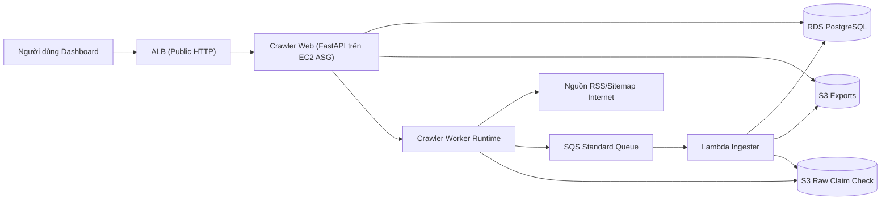
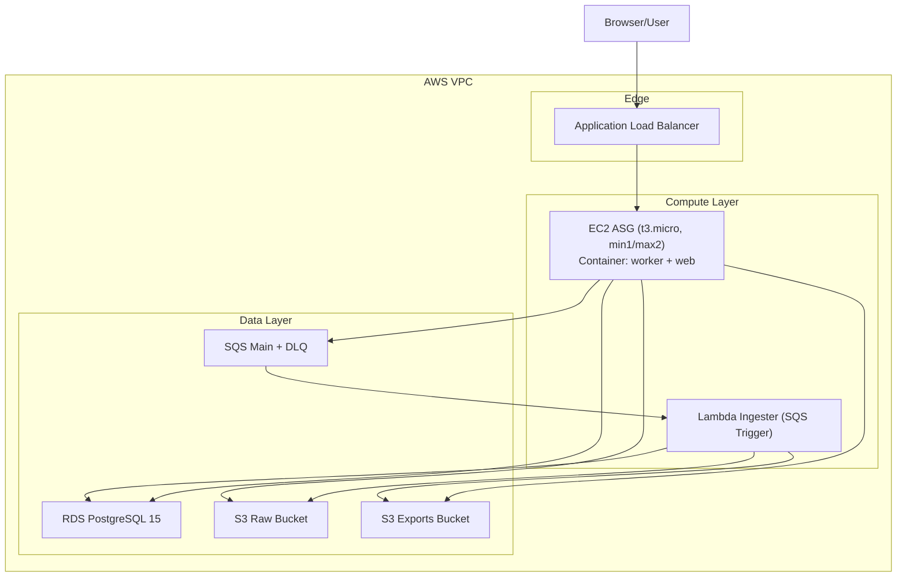
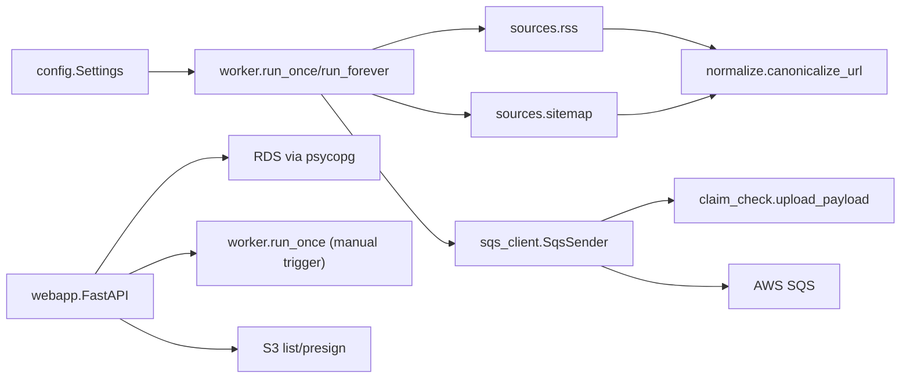
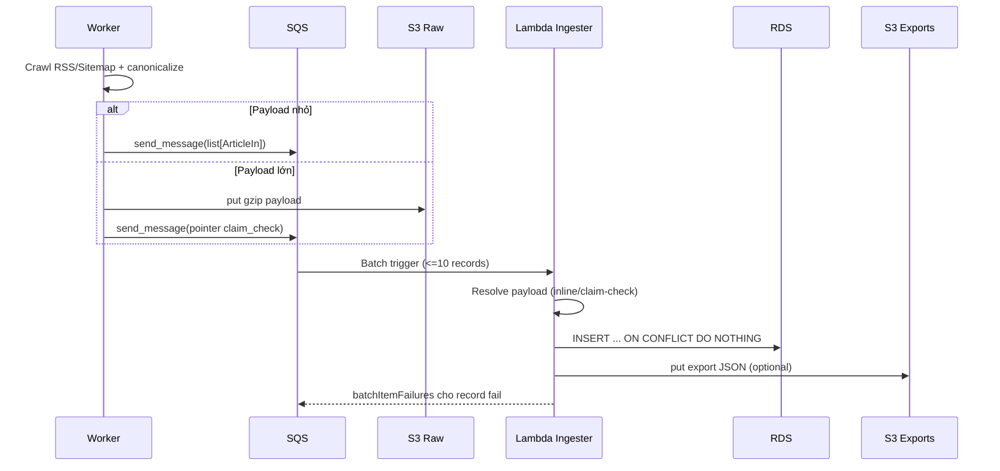

# Project Architecture Blueprint — Crawler

## 1) Mục tiêu hệ thống và bối cảnh

Hệ thống thu thập bài viết từ RSS/Sitemap, chuẩn hóa dữ liệu URL, đưa vào hàng đợi để tách tải ingest, sau đó ghi idempotent vào PostgreSQL. Dashboard web cho phép trigger crawl thủ công, quan sát dữ liệu đã ingest, và truy cập file export từ S3.

Tài liệu này mô tả kiến trúc ở mức **implementation-ready**, bám theo code và hạ tầng Terraform hiện có.

---

## 2) Pattern kiến trúc đã nhận diện

### Pattern chính
- **Event-Driven Pipeline**: Worker phát sự kiện (message) lên SQS, Lambda tiêu thụ bất đồng bộ.
- **Layered + Modular Monolith (ở tầng app Python)**: các module `config`, `sources`, `transport`, `model`, `web` tách trách nhiệm rõ.
- **Cloud-Native Distributed Components (ở tầng deployment)**: ASG EC2 + SQS + Lambda + RDS + S3 + ALB.

### Pattern bổ trợ
- **Claim Check Pattern**: payload lớn offload S3, SQS chỉ giữ pointer.
- **Idempotent Consumer**: `INSERT ... ON CONFLICT DO NOTHING`.
- **Strangler-ready boundary**: tách web app, crawler worker, ingester lambda theo contract message.

### Kết luận phân loại
Không phải microservices đầy đủ (chưa có nhiều bounded context độc lập deployment team-wise), nhưng là **distributed layered system** với **event-driven core** và **service boundary rõ** giữa producer/consumer.

---

## 3) Tech stack và dependencies

## 3.1 Runtime app
- **Python**: 3.11 (worker/web), Lambda runtime 3.12.
- **FastAPI + Jinja2 + Static assets**: dashboard và API truy vấn.
- **APScheduler**: lập lịch crawl interval.
- **httpx**: HTTP client cho nguồn RSS/Sitemap.
- **feedparser + BeautifulSoup(lxml/xml)**: parse feed/sitemap.
- **Pydantic Settings**: config typed từ env.
- **boto3**: SQS, S3.
- **psycopg**: truy vấn RDS từ web app.
- **pg8000 (Lambda layer)**: kết nối PostgreSQL từ Lambda.

## 3.2 Data/Infra
- **AWS SQS Standard + DLQ**
- **AWS Lambda (SQS event source mapping)**
- **AWS RDS PostgreSQL 15**
- **AWS S3 (raw claim-check + exports)**
- **AWS EC2 Auto Scaling Group + Launch Template + ECR**
- **AWS ALB + CloudWatch + SNS + KMS + Secrets Manager**

## 3.3 IaC / Ops / CI
- **Terraform** (`hashicorp/aws`, `hashicorp/archive`)
- **Ansible** (đồng bộ service/config trên worker)
- **GitHub Actions**: test, terraform validate/plan, build/push image, update lambda, ASG refresh.

---

## 4) System boundaries (ranh giới hệ thống)

### Bên trong hệ thống
- `crawlerdemo.worker`: crawl + gửi SQS (không ghi DB).
- `crawlerdemo.webapp`: API/dashboard đọc DB và trigger crawl thủ công.
- `lambda_ingester`: parse message + upsert DB + upload export.
- Terraform modules: provisioning toàn bộ compute/network/security/data.

### Bên ngoài hệ thống
- Nguồn RSS/Sitemap public internet.
- Người dùng dashboard qua HTTP ALB.
- AWS managed services đóng vai trò execution fabric.

### Boundary contract quan trọng
- **Message contract**: `list[article]` hoặc `claim_check_s3_*`.
- **DB contract**: bảng `articles` với unique `canonical_url`.
- **Ops contract**: env vars `CRAWLER_*`, `WEB_*`, `DB_*`.

---

## 5) Component-level breakdown

## 5.1 Crawler Runtime (`src/crawlerdemo`)

### `config.py`
- Trách nhiệm: binding cấu hình runtime theo chuẩn 12-factor.
- Extension point: thêm nguồn, mode schedule, tuning timeout/threshold qua env.

### `sources/rss.py`, `sources/sitemap.py`
- Trách nhiệm: adapter thu thập từ RSS/Sitemap -> `ArticleIn`.
- Pattern: anti-corruption nhẹ ở mức parser (chuyển cấu trúc feed/site map về model nội bộ).
- Extension point: thêm adapter mới (`sources/json_api.py`, `sources/webhook.py`).

### `normalize.py`
- Trách nhiệm: canonical hóa URL để giảm duplicate.
- Tác động kiến trúc: khóa idempotency cấp domain data.

### `sqs_client.py` + `claim_check.py`
- Trách nhiệm: gửi batch, tự quyết inline vs claim-check.
- Pattern: resilience qua fallback đường nhỏ gọn trên SQS.

### `worker.py`
- Trách nhiệm: orchestration crawl cycle.
- Rule quan trọng: một vòng crawl lỗi không hạ toàn hệ thống (`_crawl_one_source` catch per-source).

### `webapp.py`
- Trách nhiệm: dashboard + API query DB + trigger crawl manual + S3 export browse/presign.
- Kết hợp control-plane nhẹ (trigger) và read-model API.

## 5.2 Ingestion Runtime (`infrastructure/aws/lambda_ingester`)

### `lambda_function.py`
- Trách nhiệm: consume SQS, resolve claim-check, insert DB idempotent, phát hành export JSON.
- Pattern: partial batch failure (`ReportBatchItemFailures`) + commit per-record.
- Extension point: enrich/transforms trước insert, thêm routing theo source.

## 5.3 Infrastructure Modules
- `modules/networking`: VPC, subnet đa AZ, NAT, endpoint.
- `modules/security`: SG, IAM role/profile, KMS, secret.
- `modules/queue`: main queue + DLQ + TLS-only policy.
- `modules/storage`: RDS + S3 buckets (raw/exports) + lifecycle.
- `modules/lambda`: package, layer, function, ESM.
- `modules/worker`: ECR, LT, ASG, scaling policies.
- `modules/observability`: dashboards + alarms + SNS.

---

## 6) Data architecture

## 6.1 Domain model
- Core entity trao đổi trong pipeline: `ArticleIn`.
- Trường chính: `source`, `canonical_url`, `title`, `summary`, `published_at`.

## 6.2 Persistence model
- Bảng `articles`: khóa surrogate `id`, unique index `canonical_url`.
- Tối ưu query dashboard: index `source`, `fetched_at DESC`.

## 6.3 Quy tắc dữ liệu
- **Dedup**: canonical URL + unique constraint.
- **Summary trim**: giới hạn 500 chars để kiểm soát payload.
- **Timestamp**: `fetched_at` do ingester gắn khi insert.

---

## 7) C4 diagrams (ưu tiên C4)

## 7.1 C4 Level 1 — System Context



## 7.2 C4 Level 2 — Container View



## 7.3 C4 Level 3 — Component View (Application)



## 7.4 Luồng sequence ingest chính



---

## 8) Data flow và interaction chi tiết

1. Scheduler hoặc API manual gọi `run_once()`.
2. Worker crawl từng nguồn, parse ra `ArticleIn`.
3. `SqsSender.send_batch()` serialize payload, kiểm tra ngưỡng bytes.
4. Nếu lớn hơn threshold và có raw bucket, upload gzip lên S3 và gửi message pointer.
5. Lambda nhận batch từ SQS, xử lý từng record:
   - parse body/pointer,
   - loop insert từng item vào DB với idempotent SQL,
   - commit record-level,
   - log và xuất export JSON nếu có inserted rows.
6. Webapp query DB cho `/api/articles`, `/api/stats`, `/api/sources`.
7. Webapp dùng S3 API để list/presign file exports.

---

## 9) Cross-cutting concerns

### Bảo mật
- Encryption at rest: KMS cho SQS/S3/RDS.
- Transport: queue policy chặn non-TLS.
- SG tách tầng ALB/worker/lambda/RDS.
- Secret DB qua Terraform var + Secrets Manager output (hệ thống đã có secret boundary).

### Resilience
- DLQ sau `maxReceiveCount=3`.
- `ReportBatchItemFailures`: retry granular theo record.
- Worker catch per-source để không fail toàn cycle.
- ASG rolling refresh và health check `/health`.

### Observability
- Structured logs trên Lambda (JSON event style).
- CloudWatch log group cho worker/lambda.
- Alarm + SNS module observability.

### Validation
- Pydantic validate config/url list.
- API query params có giới hạn/typing.
- Sanitization key/prefix cho endpoint S3 presign/list.

---

## 10) Service communication patterns

- **Sync**:
  - Web client -> ALB -> FastAPI.
  - FastAPI -> RDS/S3 trực tiếp.
  - Worker -> RSS/Sitemap HTTP.
- **Async**:
  - Worker -> SQS.
  - SQS -> Lambda ESM.
- **Data format**:
  - JSON list articles hoặc claim-check pointer JSON.
- **Versioning hiện trạng**:
  - Chưa có explicit version field cho message schema (điểm nên mở rộng).

---

## 11) Code examples (pattern trọng yếu)

### 11.1 Idempotent ingest

```python
_INSERT_SQL = """
    INSERT INTO articles (
        source, canonical_url, title, summary, published_at, fetched_at
    ) VALUES (%s, %s, %s, %s, %s, %s)
    ON CONFLICT (canonical_url) DO NOTHING
"""
```

Ý nghĩa: cho phép retry record mà không sinh duplicate.

### 11.2 Claim Check quyết định inline/offload

```python
use_claim_check = (
    len(payload_bytes) > self.threshold_bytes and bool(self.raw_bucket)
)
if use_claim_check:
    key = upload_payload(payload_bytes, self.raw_bucket, self.raw_prefix, self.region)
    body = json.dumps({
        "claim_check_s3_bucket": self.raw_bucket,
        "claim_check_s3_key": key,
    })
else:
    body = payload_bytes.decode("utf-8")
```

Ý nghĩa: giữ message luôn an toàn dưới giới hạn SQS.

### 11.3 Manual trigger có lock chống chạy chồng

```python
with _crawl_lock:
    if _crawl_busy:
        raise HTTPException(status_code=409, detail="Đang crawl — đợi xong rồi thử lại.")
    _crawl_busy = True
```

Ý nghĩa: ngăn operator bấm trigger liên tục gây overlap trong cùng process web.

### 11.4 Settings typed + env-driven

```python
class Settings(BaseSettings):
    model_config = SettingsConfigDict(env_file=".env", env_prefix="CRAWLER_", extra="ignore")
    schedule_mode: Literal["once", "interval", "idle"] = "interval"
    interval_seconds: int = 1800
    sqs_queue_url: str = ""
```

Ý nghĩa: cấu hình nhất quán đa môi trường (local/EC2/CI).

---

## 12) ADR (Architectural Decision Records)

## ADR-001: Chọn Event-driven với SQS + Lambda cho ingest
- **Context**: crawler có burst theo nguồn, cần tách crawl và ghi DB.
- **Decision**: producer (worker) -> SQS -> consumer (lambda).
- **Consequences**:
  - (+) decouple tải và failure domain.
  - (+) scale consumer độc lập.
  - (-) tăng độ phức tạp observability, eventual consistency.

## ADR-002: Dùng SQS Standard thay vì FIFO
- **Context**: throughput ưu tiên hơn ordering tuyệt đối.
- **Decision**: SQS Standard + dedup ở DB (`ON CONFLICT`).
- **Consequences**:
  - (+) throughput cao, đơn giản tích hợp Lambda.
  - (-) thứ tự message không đảm bảo.

## ADR-003: Claim Check cho payload lớn
- **Context**: SQS giới hạn 256KB.
- **Decision**: offload payload lớn sang S3, gửi pointer.
- **Consequences**:
  - (+) xử lý batch lớn ổn định.
  - (-) thêm phụ thuộc S3 và bước resolve.

## ADR-004: Idempotency ở tầng persistence
- **Context**: retry là mặc định trong hệ async.
- **Decision**: unique `canonical_url` + `ON CONFLICT DO NOTHING`.
- **Consequences**:
  - (+) an toàn khi duplicate/replay.
  - (-) cần canonicalization nhất quán, nếu không sẽ miss dedup.

## ADR-005: Scope 1 ưu tiên chi phí
- **Context**: môi trường demo/lab.
- **Decision**: `db.t3.micro`, Single-AZ RDS, ASG min=1/max=2.
- **Consequences**:
  - (+) tối ưu cost.
  - (-) fault tolerance DB còn hạn chế, cần nâng cấp cho production nghiêm ngặt.

---

## 13) Extension points (tập trung extensibility)

## 13.1 Nguồn dữ liệu mới
- Thêm module mới trong `src/crawlerdemo/sources/`.
- Chuẩn output luôn là `Iterable[ArticleIn]`.
- Đăng ký call trong `worker.run_once()`.

## 13.2 Message schema versioning
- Khuyến nghị thêm field `schema_version` trong message body.
- Lambda branch theo version để rollout không downtime.

## 13.3 Data enrichment pipeline
- Trước insert ở lambda: thêm bước normalize/enrich/classify.
- Có thể tách thành Lambda trung gian hoặc Step Functions khi logic phức tạp.

## 13.4 Query API mở rộng
- Thêm endpoint analytics trong `webapp.py` dùng read-only SQL.
- Với tải lớn: tách query service riêng hoặc materialized view.

## 13.5 Pluggable storage
- Hiện DB write tập trung trong lambda.
- Có thể trừu tượng bằng writer interface để hỗ trợ OpenSearch/ClickHouse sink song song.

---

## 14) Scalability considerations

### Hiện trạng scale
- Producer scale: ASG policy theo CPU.
- Consumer scale: Lambda event source max concurrency.
- Buffer: SQS absorb spike.

### Nút thắt tiềm năng
- RDS write IOPS/connection khi Lambda concurrency tăng cao.
- Crawl source external có rate-limit.
- Manual trigger từ web dùng cùng process runtime (shared instance resource).

### Hướng mở rộng cụ thể
- Bật RDS Multi-AZ, tăng class/IOPS.
- Tối ưu batch insert (executemany/copy) nếu throughput cao.
- Thêm backoff/jitter/robot rules cho crawler source adapters.
- Tách web container và worker container sang ASG/service độc lập (blast radius nhỏ hơn).
- Thêm Redis cache cho dashboard stats/source list.

---

## 15) Testing architecture

- Unit tests hiện có cho normalize và source parser (`tests/`).
- Nên bổ sung:
  - Contract test cho message schema (inline + claim-check).
  - Integration test giả lập SQS event vào lambda handler.
  - Smoke test endpoint web với DB test container.

---

## 16) Deployment architecture

- Terraform compose module theo thứ tự networking -> security -> queue/storage -> lambda/worker -> alb/observability.
- Worker image deploy qua ECR + ASG rolling refresh.
- Lambda code deploy độc lập qua workflow.
- Ansible đóng vai trò config reconciliation sau khi hạ tầng chạy.

---

## 17) Governance và consistency

- IaC-first: mọi resource chính được quản lý Terraform module hóa.
- CI gate: pytest + terraform fmt/validate/plan.
- Naming/tag conventions dùng `project-environment`.
- Log retention, alarm wiring và dashboard có module riêng.

---

## 18) Blueprint triển khai tính năng mới (implementation-ready checklist)

### Trường hợp A: thêm nguồn crawl mới
1. Tạo adapter `sources/<new_source>.py` trả `ArticleIn`.
2. Viết unit test parser edge-cases.
3. Đăng ký adapter trong `worker.run_once()`.
4. Cấu hình URL mới qua `CRAWLER_*_URLS`.
5. Verify end-to-end trên môi trường demo.

### Trường hợp B: thêm trường dữ liệu bài viết
1. Mở rộng `ArticleIn`.
2. Bump message schema version.
3. Update lambda insert SQL + migration DDL.
4. Update API response mapping ở webapp.
5. Rollout theo hướng backward compatible (consumer đọc cả schema cũ/mới).

### Trường hợp C: thêm downstream consumer
1. Tạo queue/topic mới hoặc fan-out sau ingest.
2. Không phá contract queue hiện tại.
3. Đảm bảo idempotency tại consumer mới.

---

## 19) Rủi ro kiến trúc và khuyến nghị ngắn hạn

- **SSL verify trong Lambda đang tắt chặt (`CERT_NONE`)**: cần harden bằng CA bundle chuẩn RDS.
- **DB password hiện truyền trực tiếp env function/app**: nên chuyển hoàn toàn sang runtime fetch secret + rotation.
- **Chưa có schema registry/version rõ cho SQS message**: thêm version để giảm rủi ro breaking change.
- **Web trigger gọi trực tiếp `run_once` trong cùng runtime**: nên tách thành enqueue command để kiểm soát tốt hơn khi scale web.

---

## 20) Thời điểm tạo blueprint

- Generated at: 2026-04-19
- Cơ sở phân tích: code runtime Python, Lambda ingester, Terraform modules, Ansible và CI workflows trong repository hiện tại.
